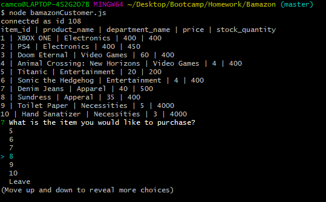
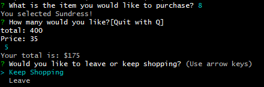
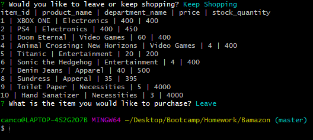

# **Bamazon**

This is *Bamazon* a command line node "Shopping" application that lets the user access a variety of items to choose from. The user can choose one product, and the amount of said item to purchase. During the transaction the amount in stock and price of said product are displayed before purchase. Upon purchase the user can leave or keep shopping.

functions
* Updating stock quantity
    * if an item is purchased that amount is removed from total quantity
* Displays total amount in sale purchase
* Allows the user to *buy* more products

**Photos**

* Beginning Page

* Purchase Page

* End Page

 **NPM(s) required**
 * inquirer
 * mySQL